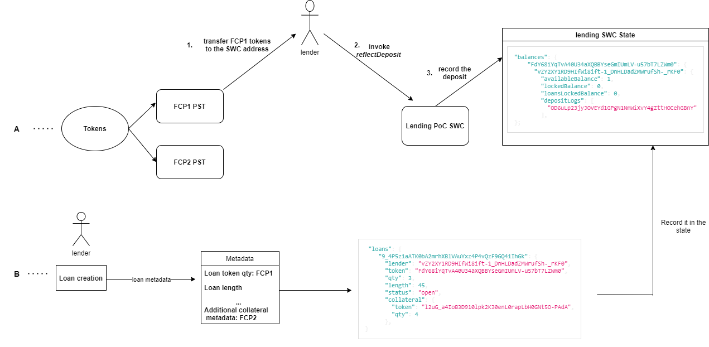
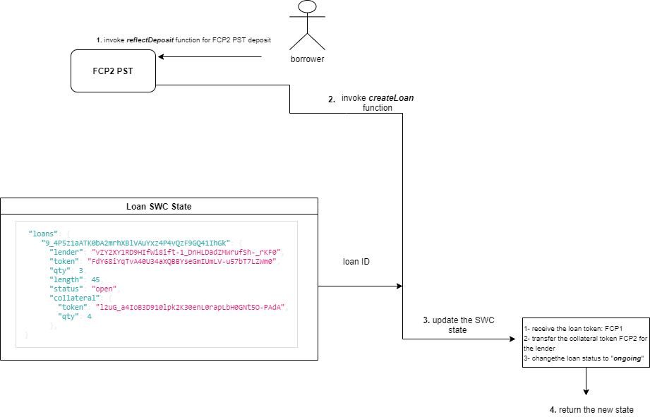
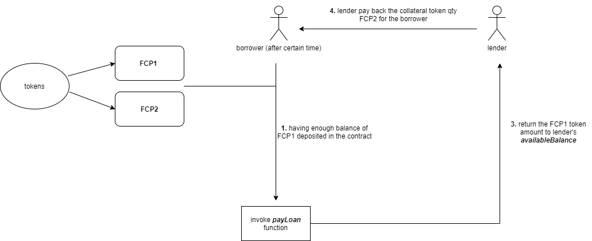

# decent.loans
a decentralized gasless lending platform built on Arweave network -- Proof of Concept (PoC). The current platform represents a P2P decentralized lending platform for Profit Sharing Tokens (PSTs).

# Synopsis
Arweave applications ecosystem still have a very limited financial apps (DeFi-like). This platform rely on the Foreign Calls Protocol (FCP) and build a future use-case for the upcoming wERC20 tokens on Arweave (PSTs).

# Workflows

## I- Deposit:

## II- Borrowing:

## III- Paying Back:

# License
This project is licensed under the MIT license.

# Special Thanks For:
<ul>
  <li><a href="https://github.com/johnletey">John Letey</a></li>
  <li><a href="https://github.com/t8"> Tate Berenbaum </a></li>
</ul>
